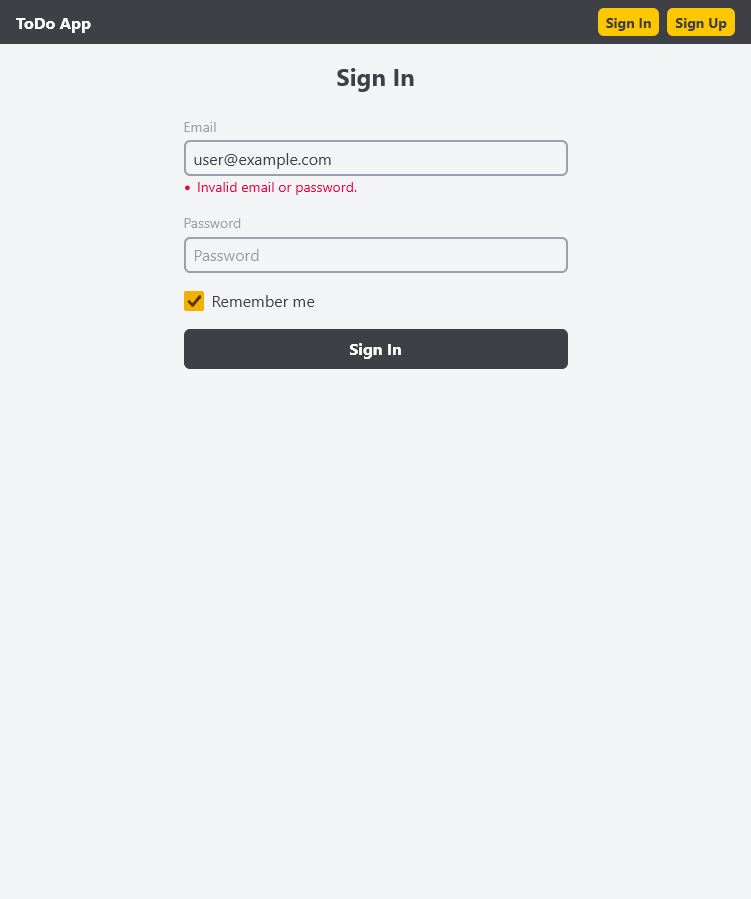
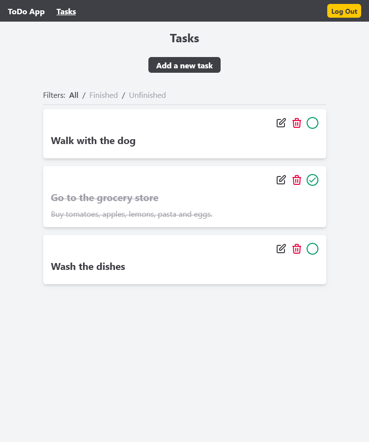
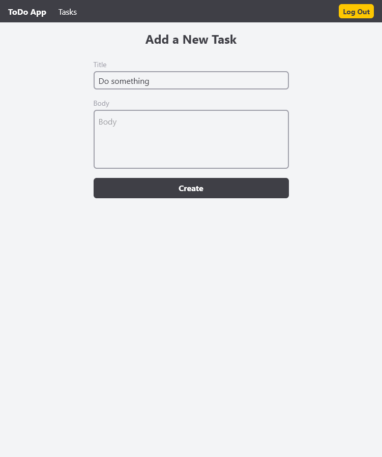

# Todo App

[**Открыть онлайн**](https://tal-todo-app.duckdns.org/)

Приложение для ведения списка дел, написанное на PHP (без фреймворка) с использованием [Twig](https://twig.symfony.com/) шаблонов вместе с Tailwind.

Для входа можно использовать следующие данные:
- Почта: `user@example.com`
- Пароль: `123123123`

Но можно и создать новый акканут с рандомной почтой (по использованному адресу никакое письмо о подтверджении аккаунта не отправляется).

---

[**Live version**](https://tal-todo-app.duckdns.org/)

An application for tracking tasks written in PHP (without using any framework) with the help of [Twig](https://twig.symfony.com/) templates alongside with Tailwind.

You can use the following credentials to sign in:
- Email: `user@example.com`
- Password: `123123123`

Or else you can create a new account using a random email address (no confirmation email is sent to the email which was used for signing up).

## Screenshots

<p align="center">
   
</p>

## Deploy for production

```sh
git clone https://github.com/try-again-later/Todo-App
cd Todo-App

# Set APP_ENV to "production"
cp .env.local .env
docker-compose up -d --build
```

The app will be available at [localhost](http://localhost).

## Run locally for development

```sh
git clone https://github.com/try-again-later/Todo-App
cd Todo-App

cp .env.development .env
docker-compose up -d todo-app-postgres todo-app-memcached

# create tables
composer install
composer run migrate:fresh

# run tailwind in watch mode
npm i
npm run dev

# run a server with the app
composer run dev
```

The app will be available at [localhost:8080](http://localhost:8080).
